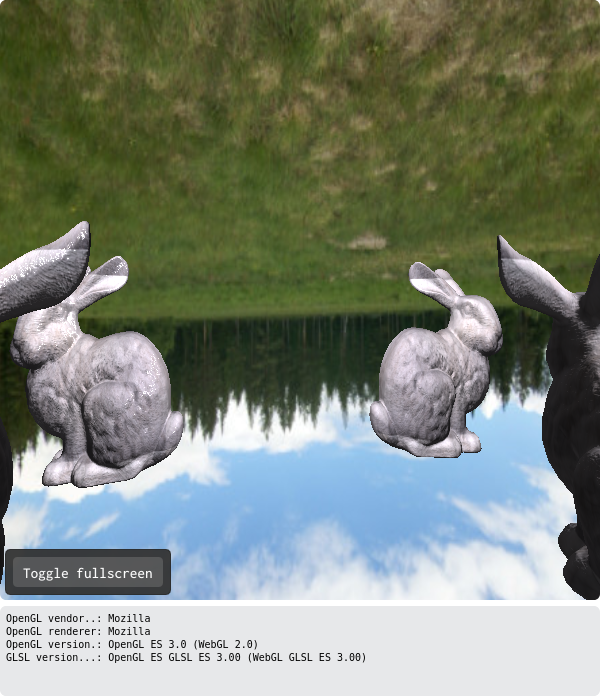
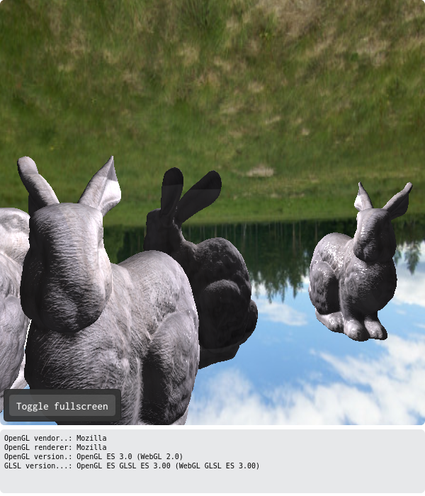

# Introdução

Mini aplicação 3D desenvolvido para compor parte da nota da disciplina de Computação Grafica na UFABC.

Discente:   Jean da Silva Neves
RA:         11086415

# Descrição

Projedo feito em OpenGL que tem como objetivo uma primeira implementação de uma das técnicas utilizadas em jogos digitais para criar a ilusão de uma imagem refletida em um espelho. Ela consiste em renderizar o cenário duplicado com o modelo dos objetos invertidos no eixo do espelho.

No projeto são renderizados 4 coelhos, 3 no cenário e um outro é o coelho que representa a câmera e é apenas visível em sua imagem refletida. Os demais coelhos também tem suas imagens refletidas no espelho.

Coelho do cenário e sua imagem refletida

Imagem refletida do coelho personagem/câmera

# ABCg

Development framework accompanying the course [MCTA008-17 Computer Graphics](http://professor.ufabc.edu.br/~harlen.batagelo/cg/) at [UFABC](https://www.ufabc.edu.br/).

## Author

Harlen Batagelo

## License

MIT
